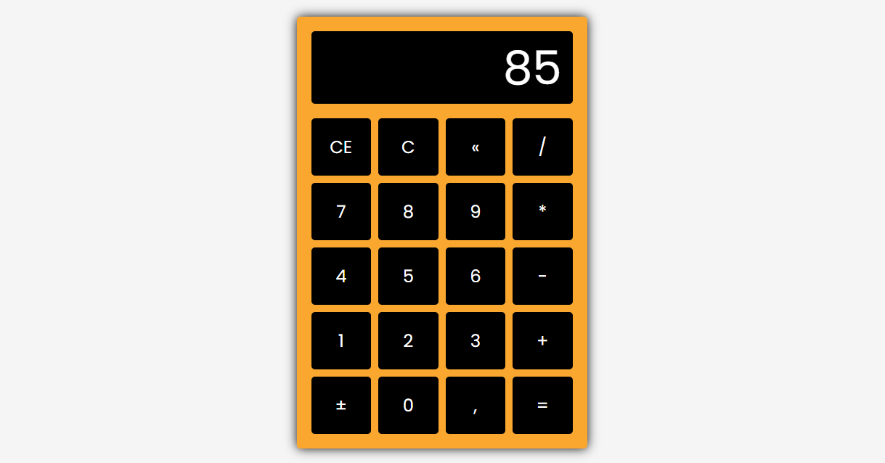

## Sobre ✔️

Desenvolvi uma calculadora utilizando HTML, CSS e JavaScript. O projeto foi criado com foco em funcionalidade e design intuitivo.
 
 

---

## Tecnologias Utilizadas 📎

Esse projeto foi desenvolvido com as seguintes tecnologias:

- [HTML5](https://developer.mozilla.org/pt-BR/docs/Web/HTML) 
- [CSS3](https://developer.mozilla.org/pt-BR/docs/Web/CSS)
- [JavaScript](https://developer.mozilla.org/pt-BR/docs/Web/JavaScript)

---

## Resultado 📷

    

